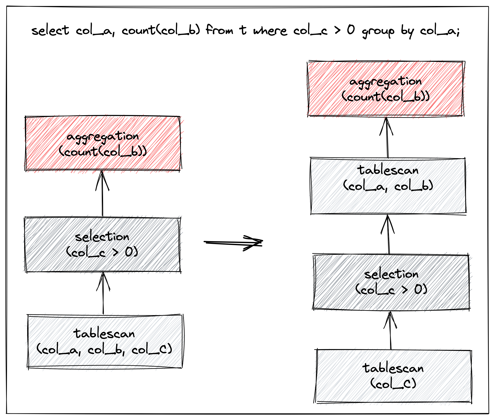
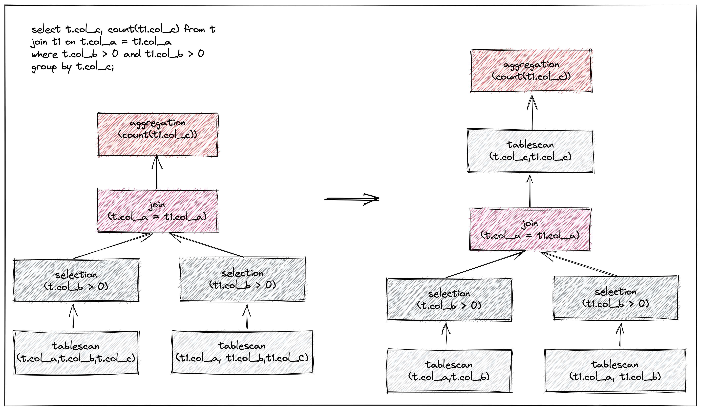

# Proposal: Support late materialization

* Author: @Lloyd-Pottiger
* Tracking issue: 

## Background

TiFlash is the key component that makes TiDB essentially an Hybrid Transactional/Analytical Processing (HTAP) database. 

Operating on positions opens a number of different query processing strategies centered around so-called "materialization". Roughly speaking, materialization is the process of switching positions back into values. The literature presents two main strategies: early and late materialization. The basic idea of late materialization is to operate on positions and defer tuple reconstruction for as long as possible. Refer to [A Comprehensive Study of Late Materialization Strategies for a Disk-Based Column-Store](https://ceur-ws.org/Vol-3130/paper3.pdf). 

There are two kinds of late materialization:
1. Late materialization in selection

    

2. Late materialization in join （#Fig.2）

    

**Only the late materialization in selection will be considered this time.**

Late materialization can help improve performance of some AP queries. Like `SELECT * FROM t WHERE col_str LIKE '%PingCAP%'` The normal execution processes are as follows:
- Read all the data pack of all the columns on table t
- Run the filter `col_str LIKE '%PingCAP%'`
- Return the result

With late materialization, the execution processes can be:
- Read all the data pack of col_str
- Run the filter `col_str LIKE '%PingCAP%'`
- Read the needed data pack of the rest columns on table t
- Return the result

And for more complex queries, like `SELECT * FROM t WHERE col_str1 LIKE '%PingCAP%' AND REGEXP_LIKE(col_str2, 'new\\*.\\*line')`, late materialization, the execution processes can be:
- Read all the data pack of col_str
- Run the filter `col_str1 LIKE '%PingCAP%'`
- Read the needed data pack of rest columns on table t
- Run the filter `REGEXP_LIKE(col_str2, 'new\\*.\\*line')`
- Return the result

Note that, `REGEXP_LIKE(col_str2, 'new\\*.\\*line')` is a heavy cost filter condition, filter out some data by `col_str LIKE '%PingCAP%'` first can reduce lots of useless calculation.

Therefore, when late materialization is enabled, we can not only reduce the number of data packs to be read but also reduce some useless calculation. If the selectivity of the pushed down filter is considerable, the performance of the query can be highly improved.

But TiFlash still does not support late materialization now. So, we are making a proposal to support it.

## Objective
- Improve performance of some AP queries.
- Without performance degradation of most queries.

## Design

In brief, we will divide the filter conditions of selection(whose child is tablescan) into two parts: 
- Those light and with high selectivity filter conditions, which will be pushed down to tablescan.
- The rest filter conditions, which will be executed after tablescan.

### TiDB side

We will decide which filter conditions will be pushed down to tablescan in TiDB planner. We should consider the following factors:
- Only the filter conditions with high selectivity should be pushed down.
- The filter conditions which contain heavy cost functions should not be pushed down.
- Filter conditions that apply to the same column are either pushed down or not pushed down at all.
- The pushed down filter conditions should not contain too many columns.

The algorithm is:
```go
func selectPushDownConditions(conditions []expression.Expression)([]expression.Expression) {
    // Group them by the column, sort the conditions by the selectivity of the group.
    // input: [cond1_on_col1, cond2_on_col2, cond3_on_col2, cond4_on_col1, cond5_on_col3]
    // - group: [[cond1_on_col1, cond4_on_col1], [cond2_on_col2, cond3_on_col2], [cond5_on_col3]]
    // - sort: [[cond2_on_col2, cond3_on_col2], [cond1_on_col1, cond4_on_col1], [cond5_on_col3]]
    //   where group on col2 has the highest selectivity, and group on col1 has the second highest selectivity.
    // output: [[cond2_on_col2, cond3_on_col2], [cond1_on_col1, cond4_on_col1], [cond5_on_col3]]
    sorted_conds = groupByColumnSortBySelectivity(conditions)
    for _, cond_group := range sorted_conds {
        // If the group contains heavy cost functions, skip it.
        // heavy cost functions: json functions, ...(to be discussed)
        if withHeavyCostFunction(cond_group) {
            continue
        }
        // If the group contains too many columns, skip it.
        // too many columns: more than 25% of total number of columns to be read, ...(to be discussed)
        if isTooManyColumns(cond_group) {
            continue
        }
        // If the selectivity of the group is larger than the threshold, push down it.
        // threshold: 0.1, ...(to be discussed)
        if selectivity(cond_group) > threshold {
            return cond_group
        }
    }
    return nil
}
```

Since we need statistics to calculate the selectivity of the filter conditions, so this algorithm should be executed in postOptimize phase.

Obviously, beacuse the selectivity of the filter conditions is accurate, and the algorithm is not optimal, we can not guarantee that the pushed down filter conditions are the best. In order to patch a workaround for performance degradation, we will add a variable `/*+ set_var(enable_late_materialization=false) */` to disable optimizer to push down filter conditions.

Therefore, it should work like this:

```mysql
# assume that function FUNC(col_str) is heavy cost function.
mysql> EXPLAIN SELECT RegionID, CounterID, TraficSourceID, SearchEngineID, AdvEngineID FROM hits WHERE URL LIKE "%google%"  AND FUNC(SearchPhrase) > 0;
+------------------------------+-------------+--------------+---------------+--------------------------------------------------------------------------------------------------------------------+
| id                           | estRows     | task         | access object | operator info                                                                                                      |
+------------------------------+-------------+--------------+---------------+--------------------------------------------------------------------------------------------------------------------+
| TableReader_15               | 79997997.60 | root         |               | data:ExchangeSender_14                                                                                             |
| └─ExchangeSender_14          | 79997997.60 | mpp[tiflash] |               | ExchangeType: PassThrough                                                                                          |
|   └─Projection_5             | 79997997.60 | mpp[tiflash] |               | hits.hits.regionid, hits.hits.counterid, hits.hits.traficsourceid, hits.hits.searchengineid, hits.hits.advengineid |
|     └─Selection_13           | 79997997.60 | mpp[tiflash] |               | gt(func(hits.hits.searchphrase), 0)                                                                                |
|       └─TableFullScan_12     | 99997497.00 | mpp[tiflash] | table:hits    | keep order:false, like(hits.hits.url, "%google%", 92)                                                              |
+------------------------------+-------------+--------------+---------------+--------------------------------------------------------------------------------------------------------------------+
5 rows in set (0.00 sec)

# disable late materialization
mysql> EXPLAIN SELECT /*+ set_var(enable_late_materialization=false) */ RegionID, CounterID, TraficSourceID, SearchEngineID, AdvEngineID FROM hits WHERE URL LIKE "%google%"  AND FUNC(SearchPhrase) > 0;
+------------------------------+-------------+--------------+---------------+--------------------------------------------------------------------------------------------------------------------+
| id                           | estRows     | task         | access object | operator info                                                                                                      |
+------------------------------+-------------+--------------+---------------+--------------------------------------------------------------------------------------------------------------------+
| TableReader_15               | 79997997.60 | root         |               | data:ExchangeSender_14                                                                                             |
| └─ExchangeSender_14          | 79997997.60 | mpp[tiflash] |               | ExchangeType: PassThrough                                                                                          |
|   └─Projection_5             | 79997997.60 | mpp[tiflash] |               | hits.hits.regionid, hits.hits.counterid, hits.hits.traficsourceid, hits.hits.searchengineid, hits.hits.advengineid |
|     └─Selection_13           | 79997997.60 | mpp[tiflash] |               | gt(func(hits.hits.searchphrase), 0), like(hits.hits.url, "%google%", 92)                                           |
|       └─TableFullScan_12     | 99997497.00 | mpp[tiflash] | table:hits    | keep order:false                                                                                                   |
+------------------------------+-------------+--------------+---------------+--------------------------------------------------------------------------------------------------------------------+
5 rows in set (0.00 sec)
```

### TiFlash side

The Process of execution of tablescan should be changed to:
1. read <handle, delmark, version>, and do MVCC filtering. Return an MVCC bitmap, which represents the availability of each tuple.
2. read columns which pushed down filter conditions need, and do filtering, return a filtering bitmap.
3. do a bitwise AND operation on the two bitmaps, and return the final bitmap.
4. With final bitmap, just read the necessary data packs of the rest columns which are needed.
5. Apply the final bitmap to the data packs, and return the final result.


## Impact & Risks

There is no optimal algorithm to determine which filter conditions should be pushed down. We can only try to implement a good solution. So, the performance of some AP queries may degrade.
We will try to make sure most AP queries would not go with performance degradation. And we can add add a variable `/*+ set_var(enable_late_materialization=false) */` to disable late materialization manually.